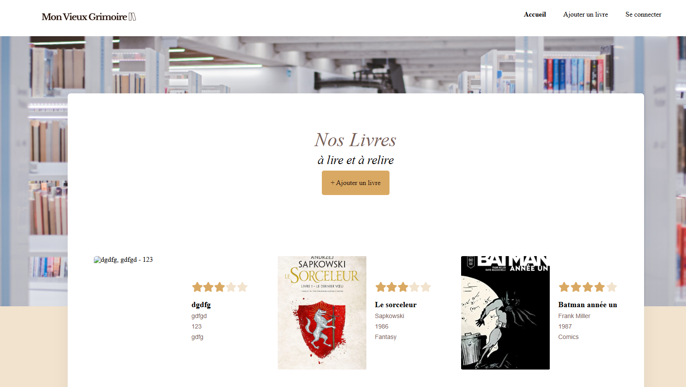

Site Mon Vieux Grimoire

Ce dépôt correspond au projet 6 de la formation Développeur Web d'OpenClassrooms. 

Il consiste à développer le back-end d'un site de notation de livres. 

Les objectifs étaient : 
- d'implémenter un modèle logique de données conformément à la réglementation
- de mettre en oeuvre des opérations CRUD de manière sécurisée
- de stocker des données de manière sécurisée

La technologie utilisée pour ce projet : 
- JavasScript
- Express
- Mongoose
- Node.JS
- MongoDB Atlas

J'ai validé ce projet le 17 septembre 2024.

Les points forts de mes livrables : 
- le code est bien segmenté en module ce qui améliore la maintenabilité
- toutes les opérations CRUD sont effectuées et expliquées
- L'unicité de l'email est vérifié
- les mots de passe sont stockés hachés dans la base de données
- les routes nécessitant une authentification sont respectées
- les erreurs sont remontées
